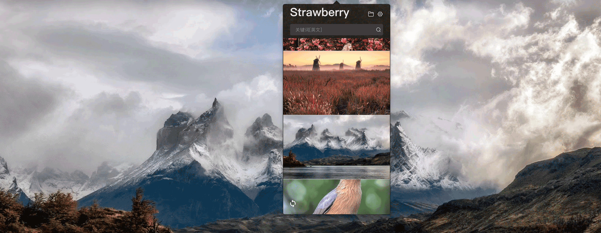
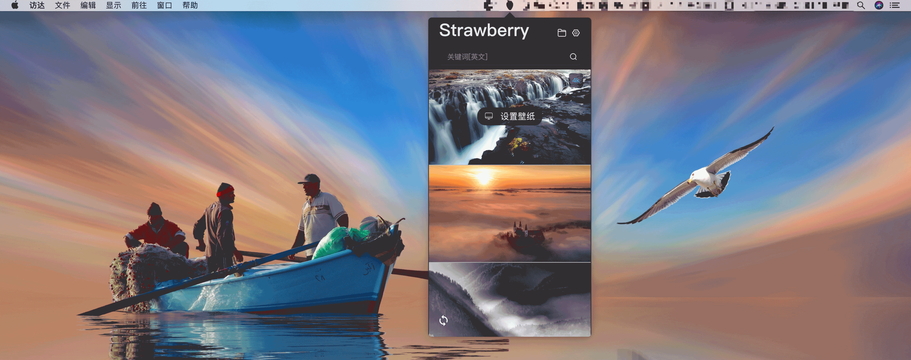
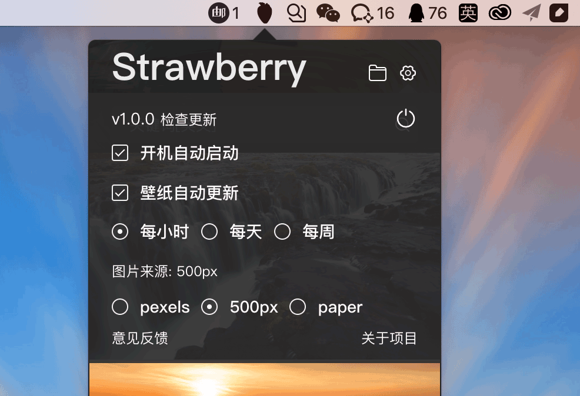

## Strawberry Wallpaper 草莓壁纸 🍓

### 一款追求更好用的桌面壁纸APP

###### `Strawberry Wallpaper` 是一款针对macOS以及windows的一款精美壁纸应用。自动更新各大图库的高清壁纸，非常适合寻找各种美的图片的你。

##### 功能：

- 目前支持paper、500px、pexels 三大图库
- 同时支持macOS与windows
- 支持壁纸预览，通过缩略图就可预览众多壁纸，同时对壁纸的尺寸做了明显的标记
- 支持关键词搜索，想寻找什么样的图片一触即得
- 支持定时设置壁纸
- 对设置过的壁纸存放到固定目录，方便随时查看
- 长期更新、完全免费

##### 亮点：

###### 简单而又不失优雅的UI设计（仿Pap.er）

###### 支持不同图库的自由切换以及支持自动定时更新壁纸

###### 更多功能欢迎下载软件试用...

##### [项目地址](https://github.com/aitexiaoy/Strawberry-Wallpaper)
##### [Windows下载](http://sw.taoacat.com/Strawberry%20Wallpaper-win.exe)
##### [Mac下载](http://sw.taoacat.com/Strawberry%20Wallpaper-mac.dmg)